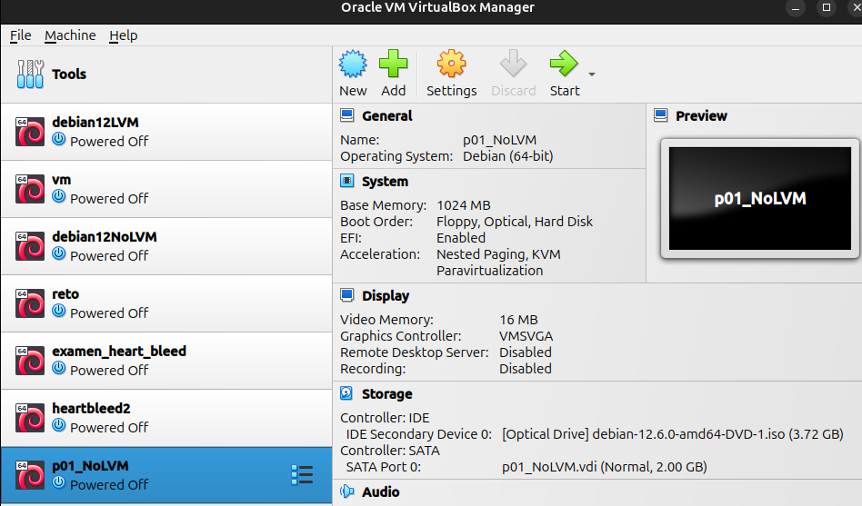
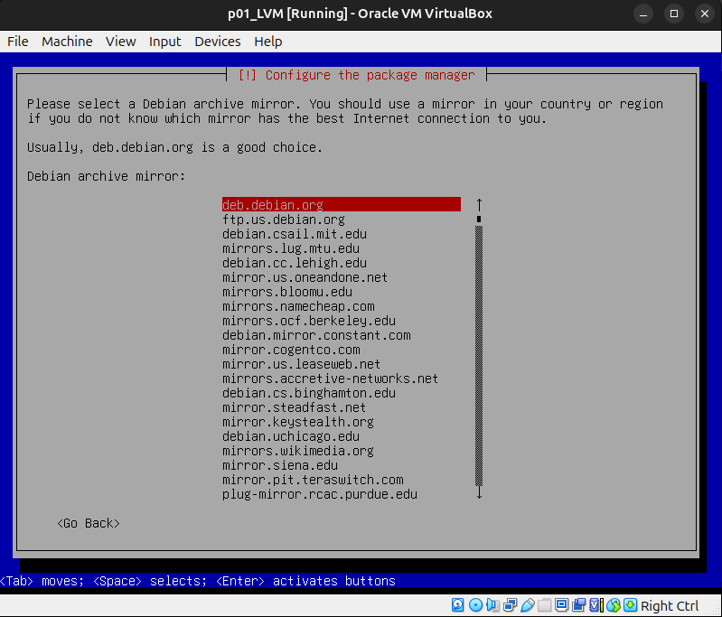

# Administracion de sistemas Unix/Linux 2025-1 
# Practica 01 - Instalación de VMware y Linux

**Nota:** Tuve demasiados problemas para instalar `VMware` en mi sistema.

```bash
->  ~ lsb_release -a
No LSB modules are available.
Distributor ID:	Ubuntu
Description:	Ubuntu 24.04.1 LTS
Release:	24.04
Codename:	noble
```

Y por cuestiones de timpo decidi usar `VirtualBox` que funciona bien para el curso.

De igual forma se presenta el proceso de instalacion de `VirtualBox`.


## Instalacion de virtualBox

```bash
sudo apt update
```

```bash
sudo apt install virtualbox
```


Luego de ejecutar el comando, la aplicacion
de virtual box se debe encontrar disponible.


Luego damos click a la aplicacion o presionamos enter.


**Nota:** Ya hay varias maquinas virtuales, pues para cuando
se realizo este reporte ya se habian trabajado en el curso.

Luego damos click en **New**


Lo cual mostrara la siguiente ventana. Le damos nombre a la 
vm y tambien seleccionamos la ISO.


Ahora, le asignamos recursos a la vm. 


**Nota:** El usar la opcion `Enable EFI(special OSes only)`
dio problemas por lo que se realizo la creacion de otra vm
sin esta opcion.


**Nota:** El usar la opcion `2GB`
dio problemas por lo que se realizo la creacion de otra vm
con `20GB`.

Confirmamos la configuracion de instalacion


Seleccionamos la vm recien creada y hacemos click en
`start`

## Instalacion de Linux sin LVM y particiones ad-hoc




Luego aparecera esta ventana con las opciones para
instalar `Debian12`


Ahora seguimos las instrucciones para la instalacion.


## Instalacion de Linux con LVM y particiones ad-hoc

La configuración de la máquina al momento de crearla es la misma.
La instalación también es la misma solo hasta esta parte:





