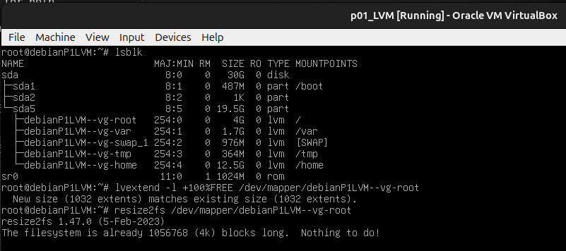

# Administracion de sistemas Unix/Linux 2025-1 
# Practica 02 - GParted y LVM

GParted (GNOME Partition Editor) es una herramienta de software libre que permite
crear, redimensionar, mover, y gestionar particiones en discos duros y otros medios
de almacenamiento.

# GParted

## Descarga de GParted

Como se mostro en el tutorial fuimos a [Descarga_de_GParted](https://downloads.sourceforge.net/gparted/gparted-live-1.6.0-10-amd64.iso)
y automaticamente comenzo la descarga del iso.


Luego para verificar

```bash
ls -lh ~/Downloads/gparted-live-1.6.0-10-amd64.iso
```

```
-rw-rw-r-- 1 israncho israncho 550M Nov 23 19:23 /home/israncho/Downloads/gparted-live-1.6.0-10-amd64.iso
```

## Mostramos el uso inicial del disco en la VM sin LVM


Vemos que los valores que indican los tama~nos y espacio disponible
son menores que los que se muestran en el manual de la practica, 
pues esta VM se creo con solo 10GB de espacio, pero de ahi en fuera
son los mismos campos.

Luego apagamos la maquina virtual

```bash
su - root 
poweroff
```

Y configuramos para que el arranque sea desde la
iso de GParted.


Vemos que los valores son muy similares a los que se
mostraron cuando se ejecuto `df -h` dentro de la VM
aunque las cantidades llegan a diferir un poco, muy
seguramente debido a un redondeo.

## Comenzamos modificando /dev/sda8

Seleccionamos la particion `/dev/sda8` y luego seleccionamos
la opcion `Resize/Move`


Liberamos exactamente la mitad del espacio


Ahora moveremos las particiones

- `/dev/sda5`
- `/dev/sda6`
- `/dev/sda7`


Modificamos `/dev/sda2` para poder asignar el espacio no asignado a `/dev/sda1`.


 


Aceptamos los cambios.


Luego salimos y arrancamos de forma normal.
No olvidemos cambiar el dispositivo de arranque.


Ahora verificamos los cambios ejecutando los comandos `df -h` y `lsblk`.


En efecto los cambios se aplicaron bien y los tama~nos de las particiones
si cambiaron.

# LVM
## Configuración de discos con LVM (solo para VMs con LVM)

Lo primero que realizamos es aumentar el espacio del disco.


Ahora si arrancamos el sistema y ejecutamos `df -h` y `lsblk`.


Si hacemos cuentas de lo que da el comando `df -h`

```
.960 + .197 + 3.9 + .984 + .005 + .455 + .332 + 1.6 + 13 + .197
= 21.63
```

Que nos da aprox los 20GB que se le habian asignado incialmente 
a la VM. Aunque el comando `lsblk` si nos muestra que el disco
`sda` tiene 30GB de capacidad.

Instalamos `parted` y `e2fsprogs`


Ahora verificamos los dispositivos scsi disponibles y realizamos
un `rescan`.


Ahora abrimos `parted` y ejecutamos el comando `print`


Se nos muestra un disco `ATA VBOX HARDISK (scsi)`, el cual es
el disco virtual del virtual box, el cual en efecto
tiene capcacidad de 32.2GB y un tama~no de sector de 512B.

Se nos muestran 3 particiones, la primera configurada
para arranque, la segunda que es el contenedor de las particiones
logicas y la tercera que es la que ya usa LVM.

Procedemos a agrandar la particion 2 al maximo posible


Vemos que en la particion 2 ha tomado todo el espacio que esta libre.

Ejecutamos los ultimos comandos

.

--------------------------------
 
Nos damos cuenta que tambien nos falto agrandar la particion 5 que tiene 
el LVM cuando usamos `parted`

.
.
.

Por ultimio vemos ya el espacio ampliado

.
