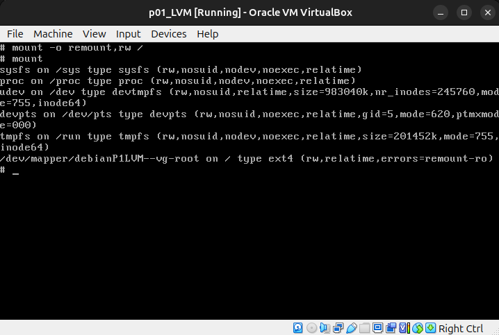

# Administracion de sistemas Unix/Linux 2025-1 
# Practica 03 - Asegurando GRUB 

### Jesus Israel Gutierrez Elizalde


Agregamos la opcion `init=/bin/sh:` para que durante el arranque en lugar de iniciar
el sistema normalmente, cargue una shell /bin/sh.

.

Luego presionamos `ctrl+x` o `F10`, en mi caso lo que funciono fue `F10`

.

Ejecutamos `mount` para montar el sistema

.

Ejecutamos `mount -o remount,rw /` para volver a montar el sistema
pero ahora con permisos de lectura y escritura

.

Ahora cambiamos la contrase~na del root y reiniciamos el sistema

.

.

.

Como `root` ejecutamos

```
grub-mkpasswd-pbkdf2 | tee -a /etc/grub.d/40_custom
```

y luego terminamos de modificar `/etc/grub.d/40_custom`
con `vi`

.

.

Reiniciamos el sistema y vemos que en efecto ahora se pide contrase~na
para cualquier opcion de grub

.
