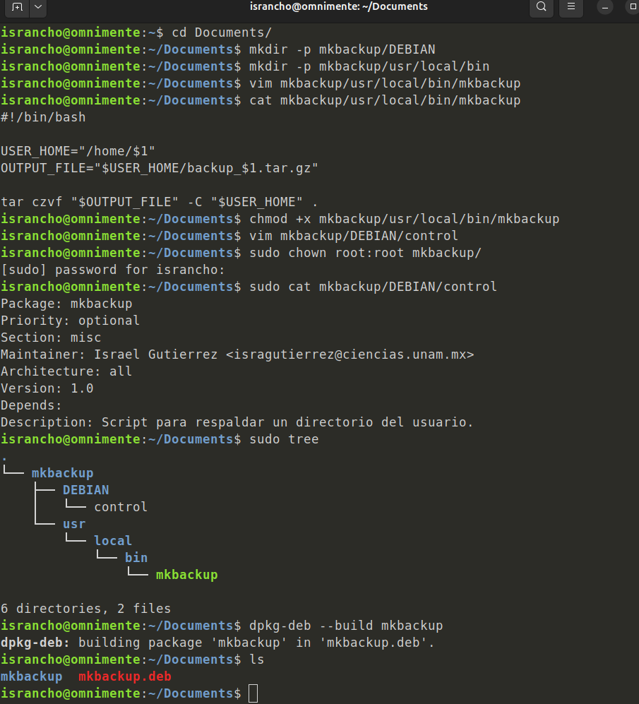
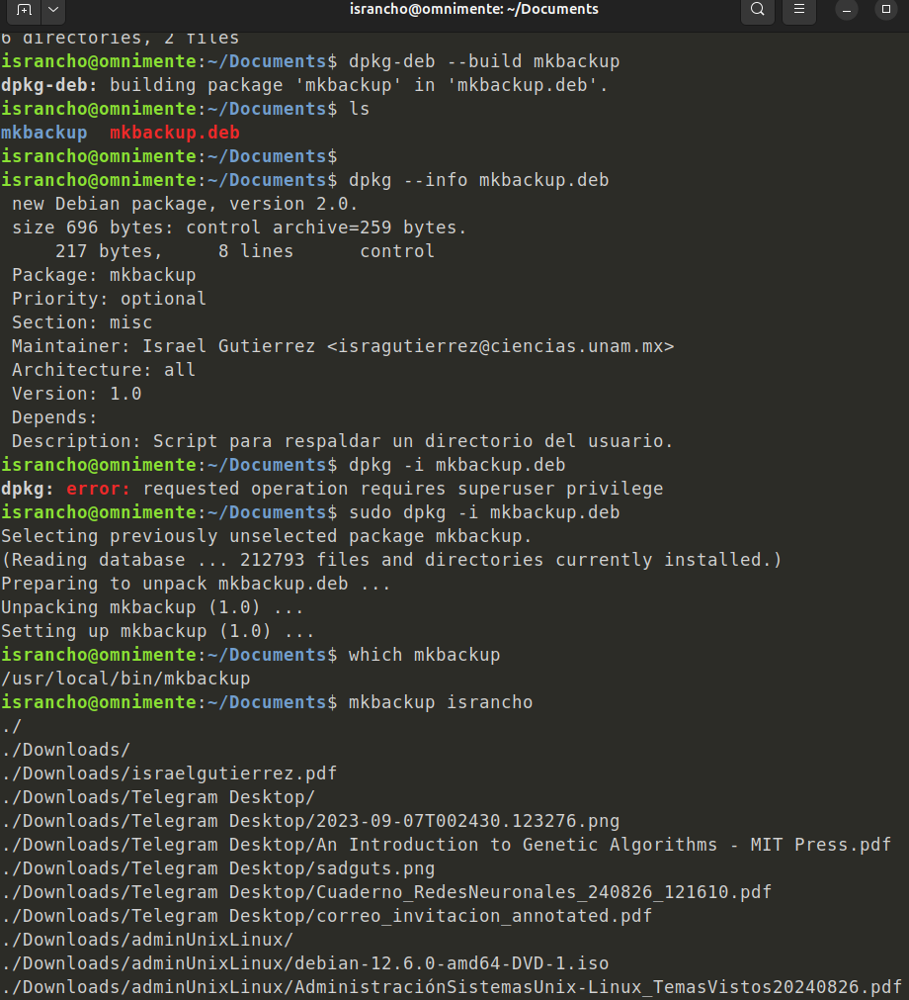
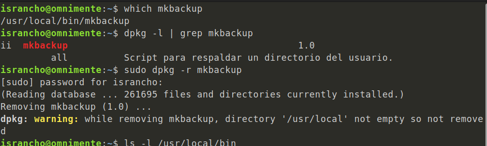
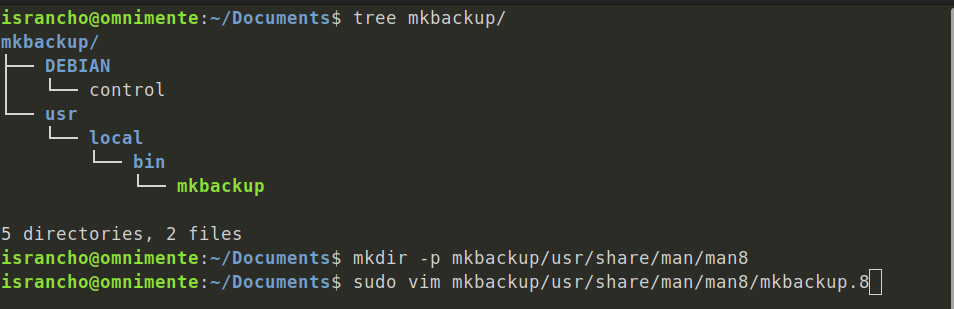
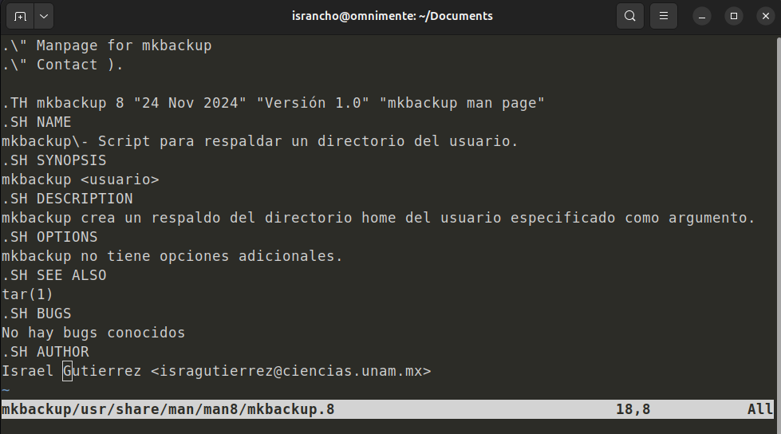
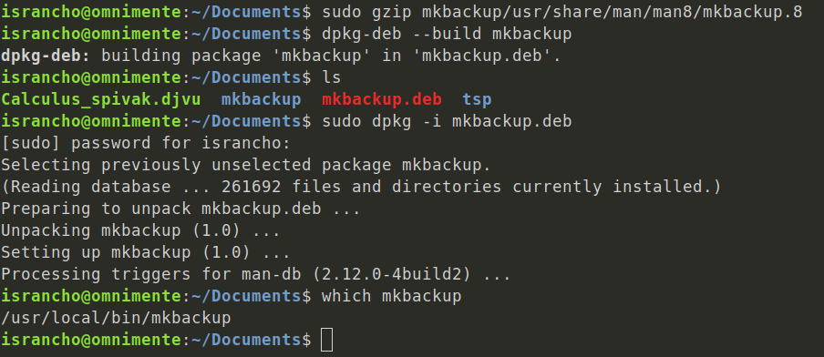
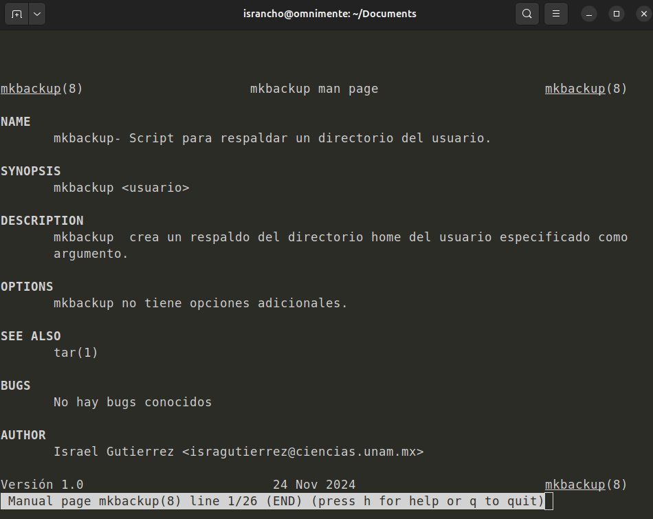

# Administracion de sistemas Unix/Linux 2025-1
# Practica 04 - Paquetes deb y Paginas de manual

### Jesus Israel Gutierrez Elizalde

## Creacion de nuestro paquet deb

Creamos nuestro propio paquete DEB usando  [`dpkg`](https://en.wikipedia.org/wiki/Dpkg),
el paquete es para realizar un respaldo del directorio `/home`
de un usuario dado, para crear el respaldo usamos [`tar`](https://en.wikipedia.org/wiki/Tar_(computing)),
a continuación mostramos todo el proceso de creación.

.

.

Ahora, para realizar bien todo el proceso de crear el manual,
ahora desinstalaremos el paquete que ya teniamos instalado

.

Ahora creamos el manual para el paquete DEB

.

.

Volvemos a generar el .deb y lo instalamos

.

Por ultimo para verificar ejecutamos

```bash
man mkbackup
```

.
