# Administracion de sistemas Unix/Linux 2025-1
# Practica 05 - Compilar un kernel

El compilar el kernel es un proceso pesado
por lo que le daremos mas recursos a la maquina virtual
donde realizaremos esto.

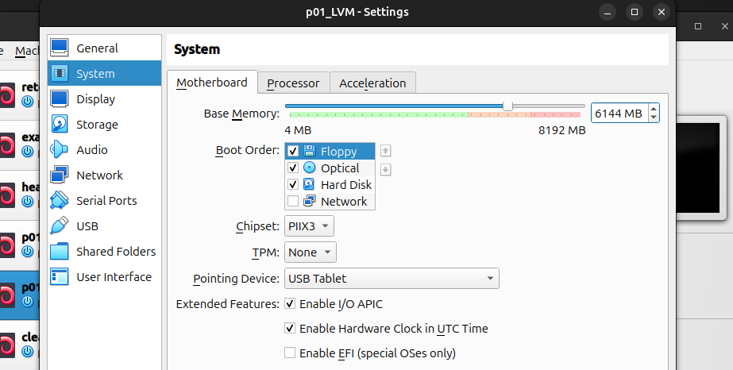

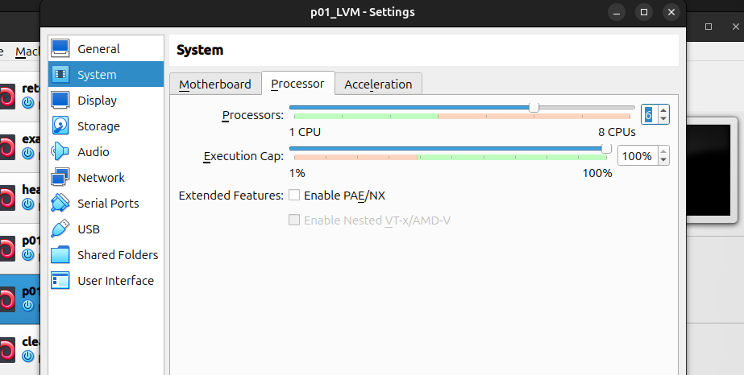

Seleccionamos una vm con suficientes recursos 

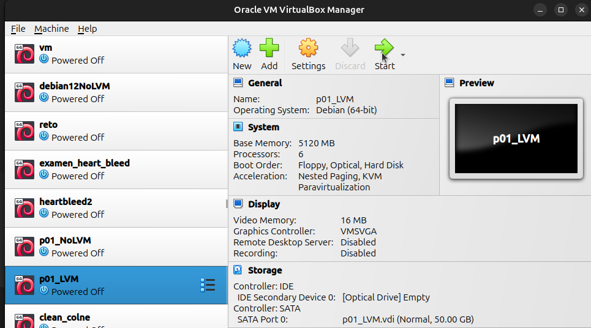

Instalamos todo lo necesario para poder compilar el kernel

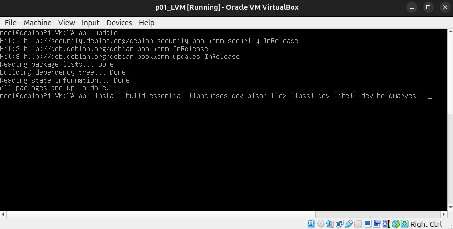

Vemos el kernel actual, vemos el espacio disponible y por
ultimo descargamos otra version del kernel.

En mi caso use `curl ` porque por alguna razon `wget`
se quedaba esperando sin descargar nada.

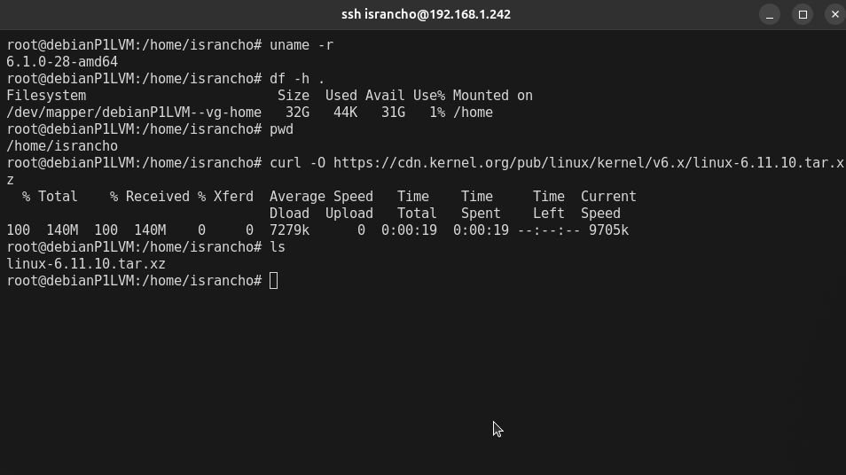

Lo descomprimimos

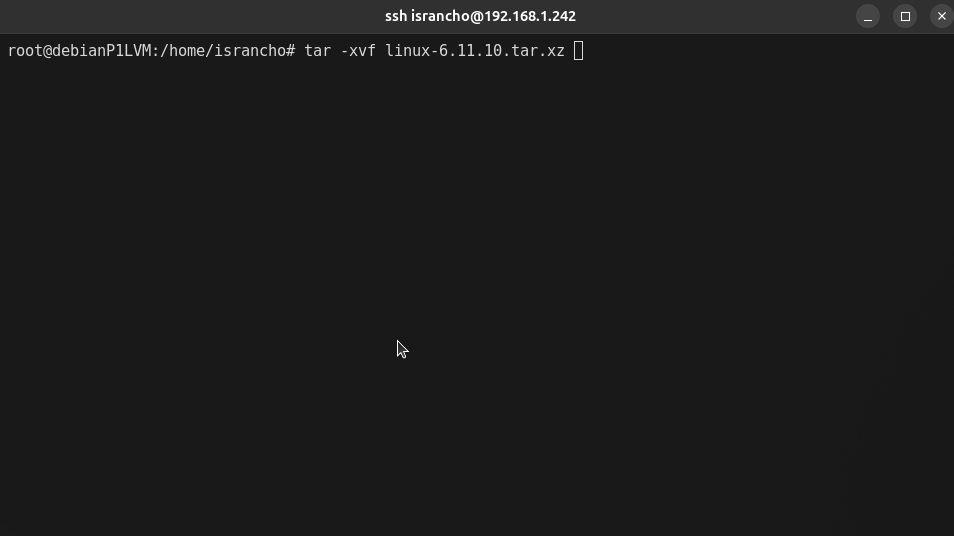

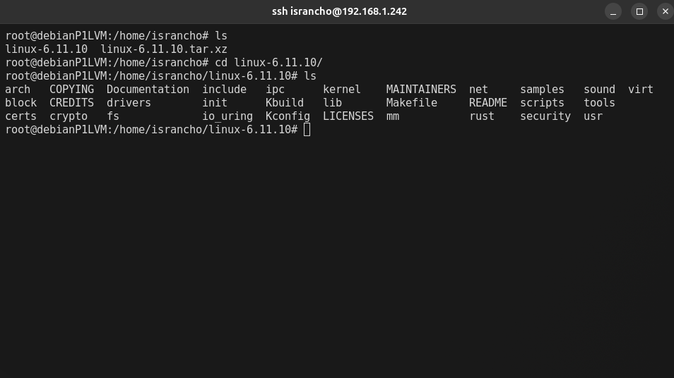

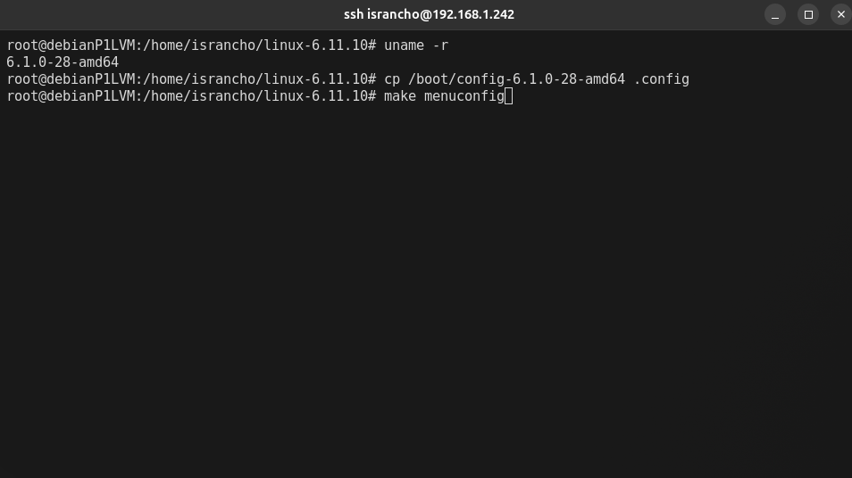

Seleccionamos `load`
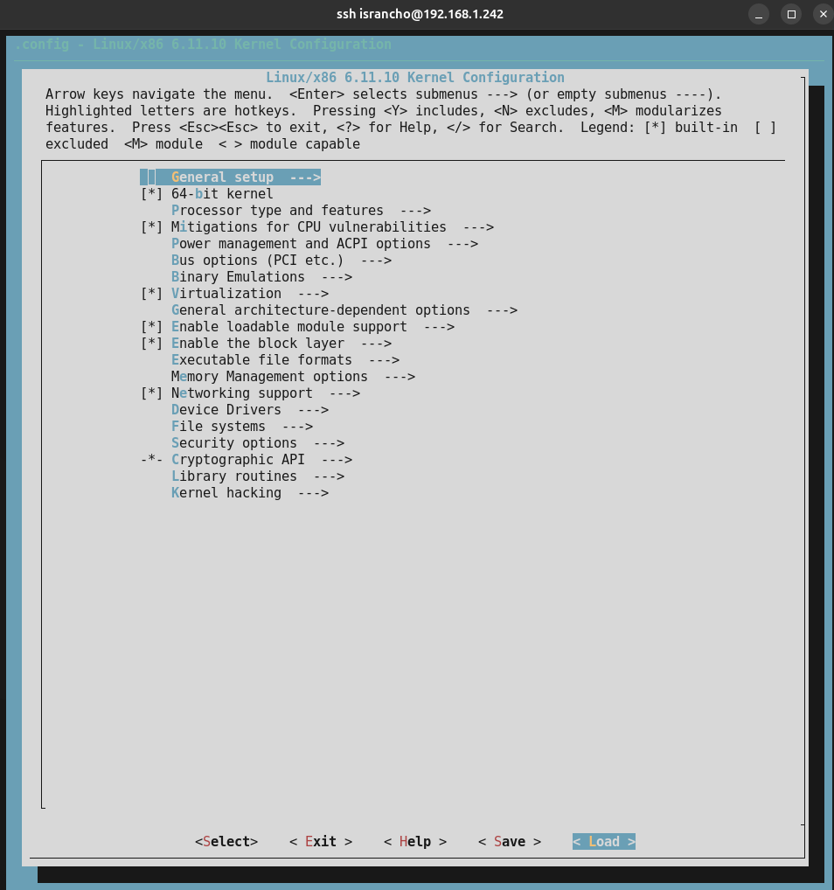

Ahora seleccionamos `save`

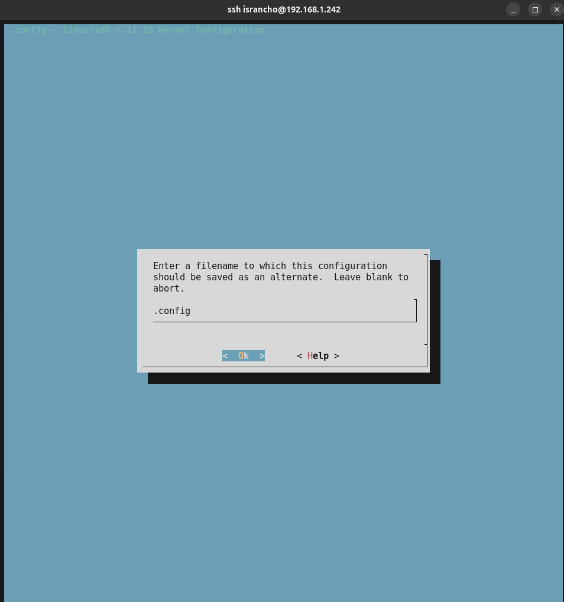

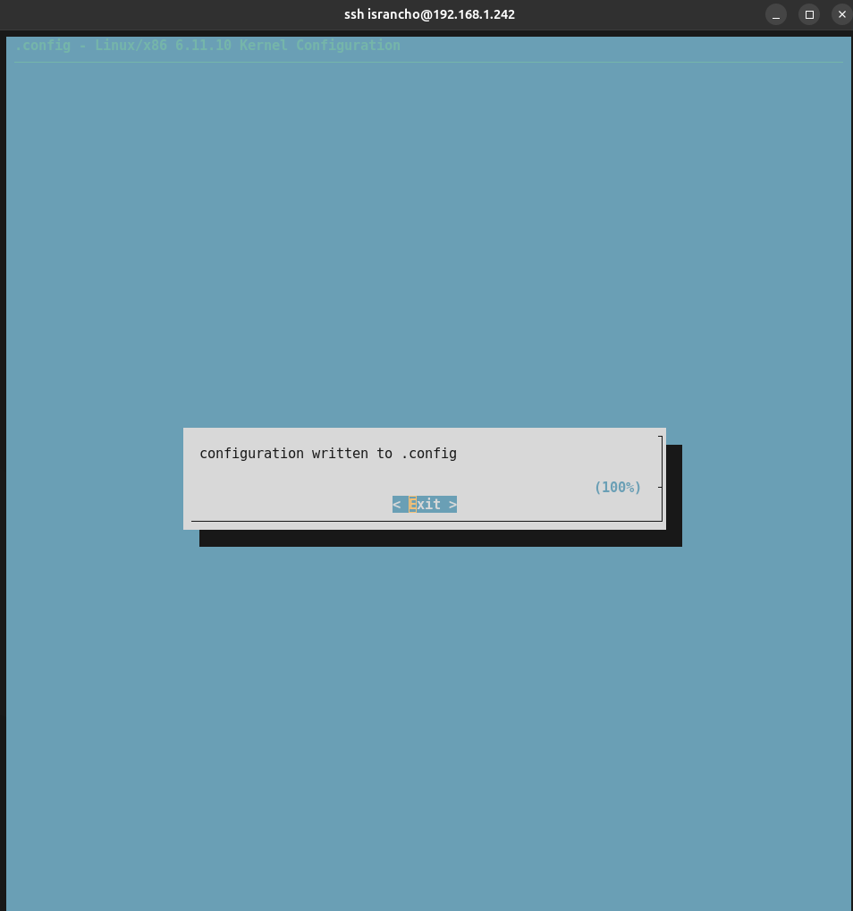

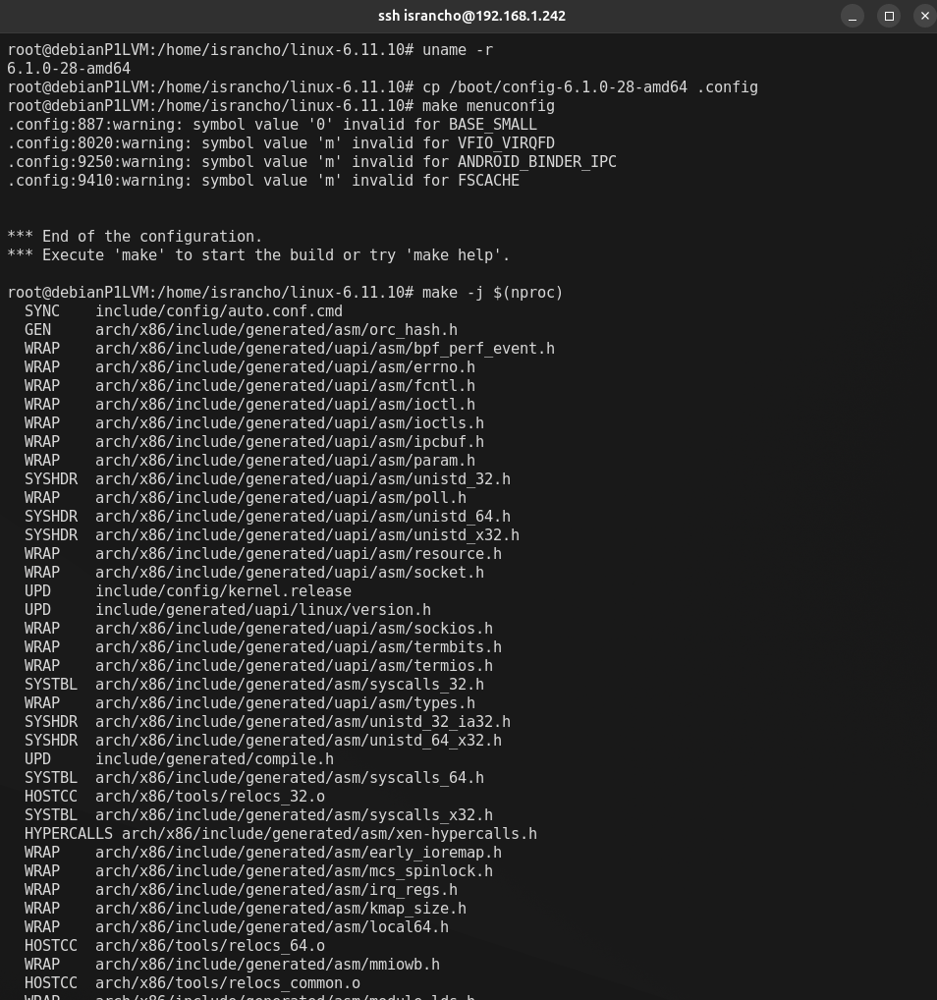

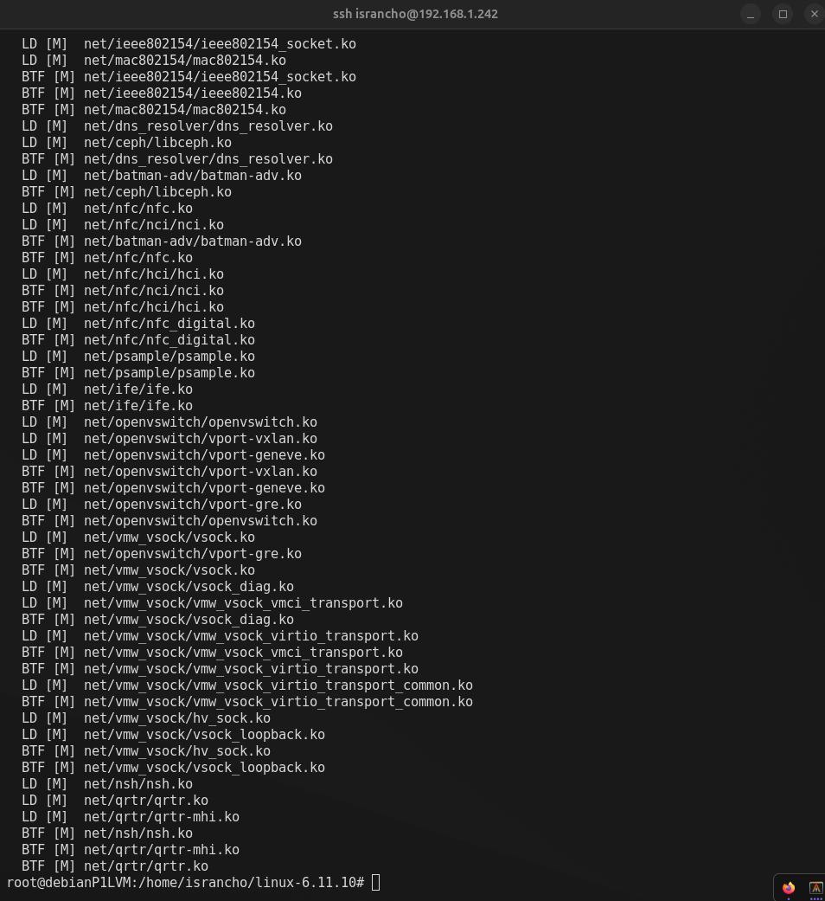

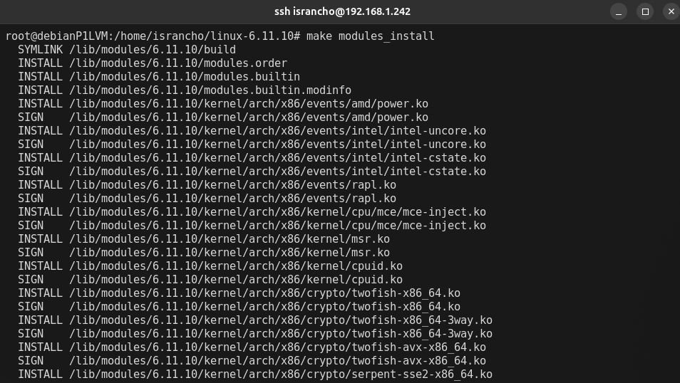

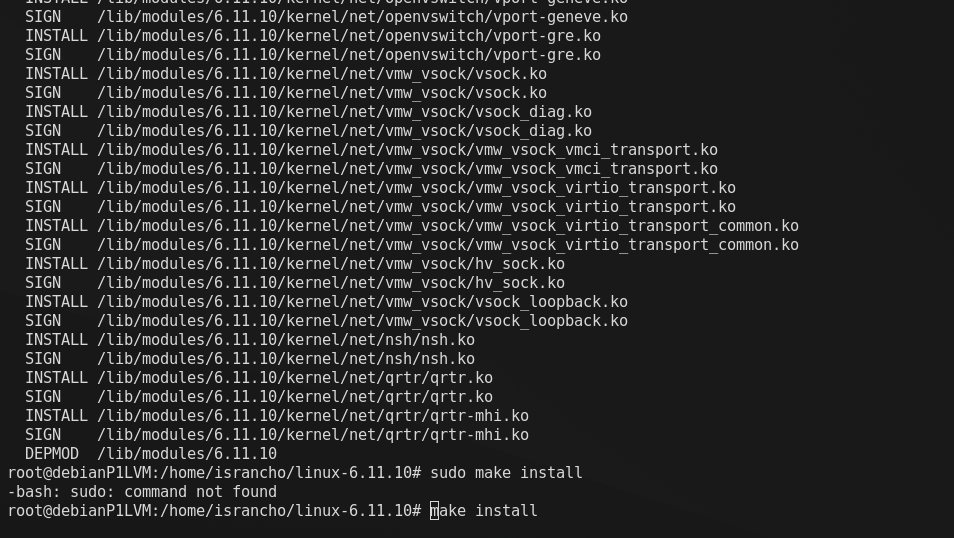

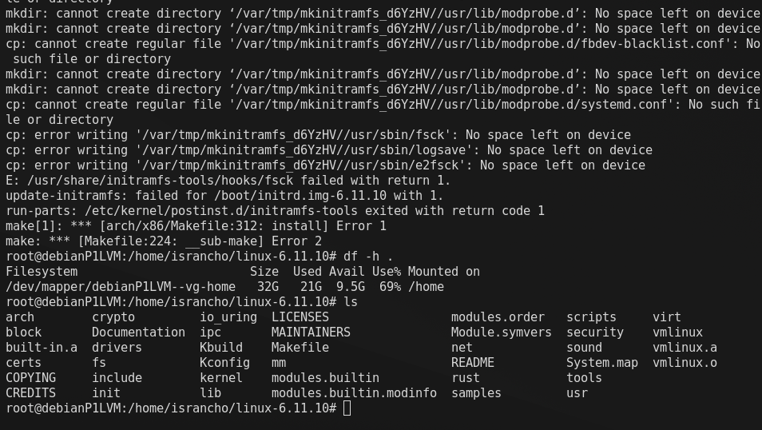
