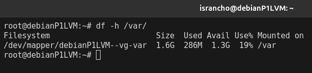
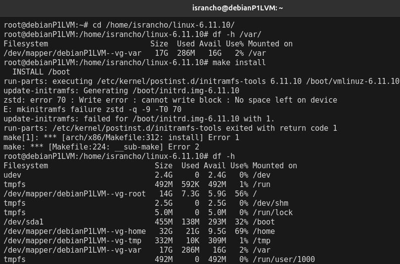
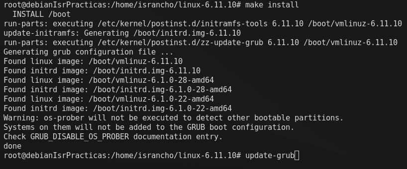
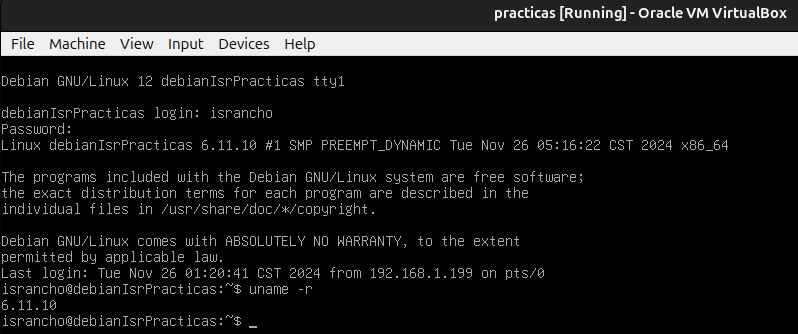

# Administracion de sistemas Unix/Linux 2025-1
# Practica 05 - Compilar un kernel

### Jesus Israel Gutierrez Elizalde

El compilar el kernel es un proceso pesado
por lo que le daremos mas recursos a la maquina virtual
donde realizaremos esto.


Seleccionamos una vm con suficientes recursos 


Instalamos todo lo necesario para poder compilar el kernel


Vemos el kernel actual, vemos el espacio disponible y por
ultimo descargamos otra version del kernel.

En mi caso use `curl ` porque por alguna razon `wget`
se quedaba esperando sin descargar nada.


Lo descomprimimos


Copiamos la configuracion que ya estaba en uso
y ejecutamos 

```
make menuconfig
```


Seleccionamos `load`


Ahora seleccionamos `save`


Compilamos el kernel ejecutanto

```
make -j $(nproc)
```


Luego compilamos los modulos necesarios
que fueron seleccionados en la configuracion.


Preparamos nuestro kernel para usarlo


Hubo un error pues nos quedamos sin espacio en `/var`




Le di mas espacio a `/var`, pero al parecer
tambien hay poco espacio en `/boot`, por lo que
ahora agrandare este



Hubo muchos problemas con el espacio por lo 
que se decidio usar otra virtual con mas espacio.

Se retoma la evidencia para la practica desde de donde
se dejo pero ejecutandose desde otra vm.



Despues de actualizar el grub, reiniciamos y verificamos el cambio de
kernel.


