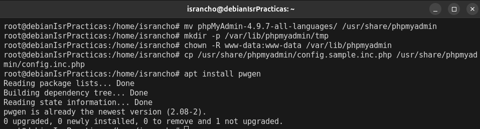
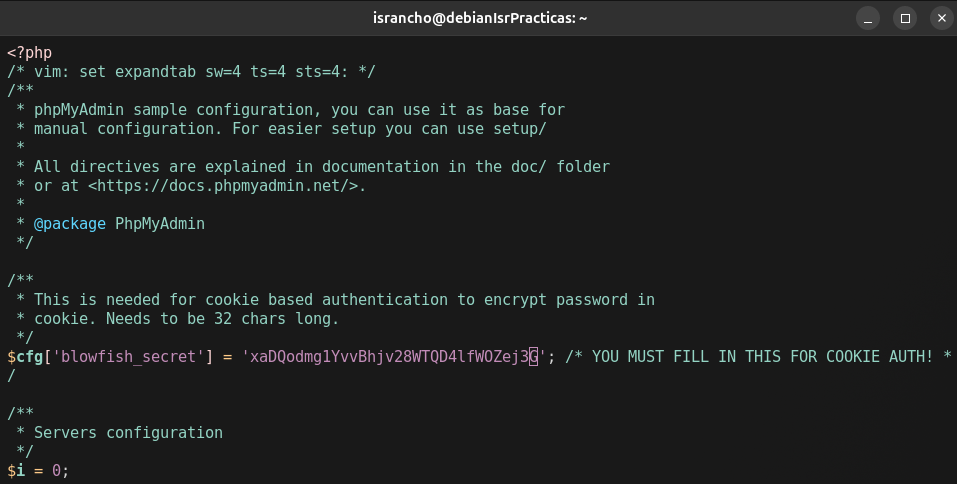

# Administracion de sistemas Unix/Linux 2025-1
# Practica 06 - Instalar phpMyAdmin desde el codigo fuente 

### Jesus Israel Gutierrez Elizalde

## Requisitos previos

Mostramos los pasos para instalar y configurar un entorno LAMP
(Linux, Apache, MySQL/MariaDB, PHP)

Instalacion de Apache y MariaDB server

Mejoramos la seguridad de nuestra instalacion de MariaDB

Instalamos PHP y las bibliotecas necesarias para que PHP funcione con Apache y MariaDB.

## Instalacion de phpMyAdmin y paquetes recomendados

Instalamos las extensiones adicionales de PHP necesarias para el
funcionamiento de phpMyAdmin

Descargamos el código fuente de phpMyAdmin

Configuramos phpMyAdmin

Creamos las tablas

Creamos los usuarios necesarios

Creamos el archivo de configuracion de phpMyAdmin para
apache

habilitamos el archivo de configuracion de phpMyAdmin para
apache

Ahora verificamos que todo salio de forma correcta

