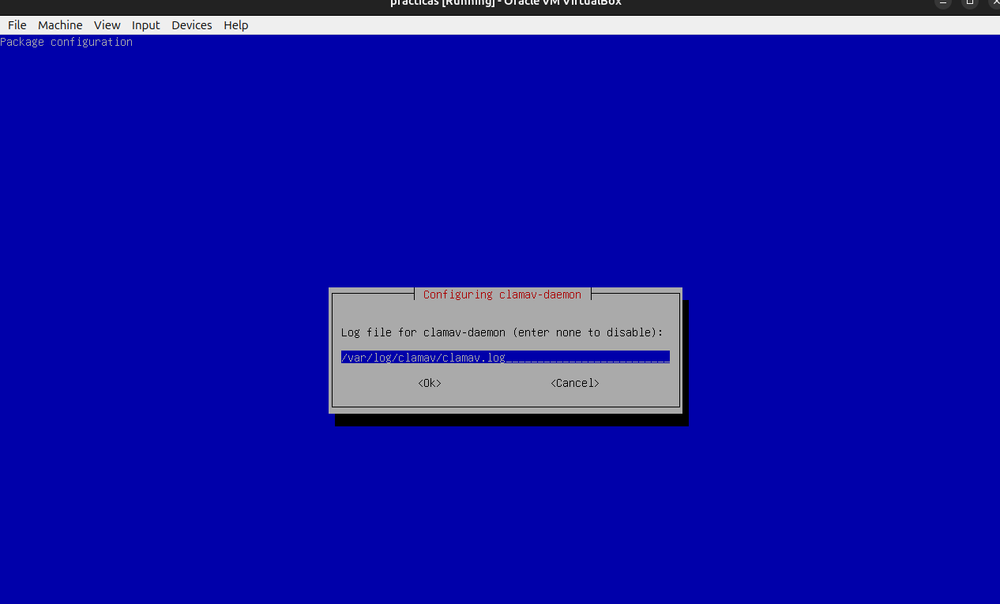
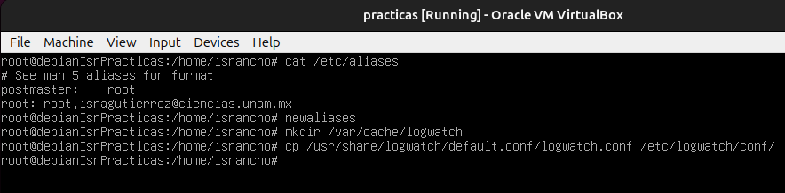

# Administracion de sistemas Unix/Linux 2025-1
# Practica 06

## Fail2ban

Realizamos la instalacion y configuracion de 


Editamos el archivo `jail.local`, estando en 
`/etc/fail2ban`

```bash
vim jail.local
```


Luego configuramos a fail2ban para que use
systemd para leer los registros del sistema 


Probamos banear y desbanear ips con fail2ban


## ClamAV
ClamAV es un antivirus de código abierto diseñado para detectar
virus, malware y otras amenazas en sistemas Linux

Instalamos ClamAV y su Daemon y ademas 
lo configuramos





Ahora verificamos el servicio freshclam


Actualizamos la base de datos de clamAV


Creamos un script `clamavscan.sh` en el directorio de
tareas diarias y lo probamos


## Postfix y Logwatch 

Postfix es un servidor de correo para enviar y recibir mensajes, y
Logwatch, una herramienta para generar y enviar informes de los registros del sistema.

Con estos dos en conjunto podemos recibir correos con
reportes del sistema.

Comenzamos con la instalacion


Y tambien realizamos la configuracion de postfix


Indicamos  a que direcciones deben
redirigirse los correos enviados a postmaster y root


Ahora, creamos el directorio cacheh para Logwatch y copiamos el archivo de
configuración principal de Logwatch (logwatch.conf) al directorio de configuración en `/etc`.



Abrimos el archivo logwatch.conf y cambiamos el método

de salida de los informes, para que ahora sea mail.


Probamos


